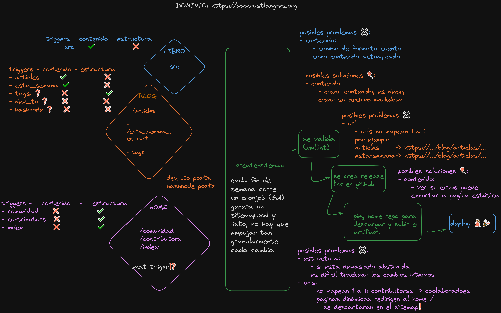

## install:

* windows:
  * scoop: https://scoop.sh/
  * scoop bucket add main
  * scoop install main/busybox
  * scoop install main/libxml2

* unix:
  * libxml2

## 🍕 diagrama general



- (buena practica) antes de crear algún cambio modificar el diagrama❗
- [diagrama](https://excalidraw.com/#json=-Q7YuEfpfYP3Qz52P9QrW,UYLXEYM7G2KjSCTfwbt9hw)

## 🍔 Instructions

- fetch below repositories:
  - ```sh
    git clone https://github.com/RustLangES/blog.git
    git clone https://github.com/RustLangES/RustLangES.github.io.git home
    git clone https://github.com/RustLangES/rust-book-es.git book
    git clone https://github.com/RustLangES/rust-para-dotnet-devs.git dotnet
    ```
- Sólo elegís el script para tu sistema, no tengas miedo de otros scripts de otros sistemas operativos no te van a morder.
  - windows: `generate.bat`
  - unix: `generate.sh`

## ✨ Agregando un nuevo libro ó pagina para indexar:

- obtener los path que van ser indexados, por ejemplo:
  - para el libro _rust para dotnet devs_:
    - clonar el repositorio `https://github.com/RustLangES/rust-para-dotnet-devs.git`
    - asignarle un nombre de una sola palabra `git clone https://github.com/RustLangES/rust-para-dotnet-devs.git dotnet`
    - obtener los path de las nuevas páginas para ser indexadas.
      - trae las archivos de forma recursiva: `git ls-tree -r --name-only HEAD --full-tree src/es`
      - filtramos y formato: `grep "\.md$" | awk -F "." "{print $1}"`
      - podes ver un ejemplo para bash o batch en `/scripts`
    - agregar al `ignore_paths.rs` los path que no tienen sentido como:
      - `dotnet/src/es/SUMMARY`,
      - `dotnet/src/es/license`
    - ajustar apropiadamente `src/bin/generate.rs`
      - podes usar de referencia: `https://github.com/ph4un00b/sitemap-rustico/commit/2c0e4e761fd48d25ff2d27f89723d11e57140c59`

## 🧪 testing workflow

- deps:
  - docker
  - gh
  - act
- act.exe -j test -s GITHUB_TOKEN="$(gh auth token)"

## 🍗 hard todo

- [ ] remove xmllint

## ✨ todo

- [ ] el código no esta tan trabajado si querés mejorar la estructura, podes contactar antes en la comunidad para retroalimentar y no mal usar vuestro tiempo.
- [ ] mejorar el readme para agregar libros.
